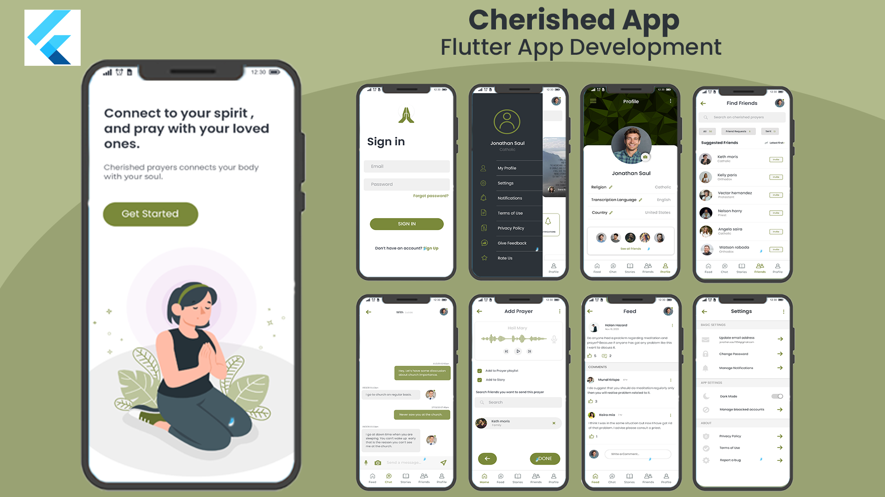

# [Cherished Prayers - Social Media for the Pious](https://portfolio.kaykobadreza.com/portfolio/cherished-prayers/)      

      

## Overview
In today’s world, people are getting away from God and do not offer prayers. The people who want to offer prayers must face many difficulties as they do not know the proper methods and notes they must speak while offering the prayer. Moreover, many people have many questions about the verses and the prayer methods and hesitate to ask someone. Those who ask may have to put some effort into asking as they must search Imam for it. Moreover, people's knowledge in this world is minimal for religion.

> “Prayer does not change God, but it changes him who prays.”

To solve these problems, I built a system named “Cherished Prayers System,” where users will have the advantage of setting a proper verse for all the people within the group. This system will ensure the timely praying of a lot of people. The first thing that this system does right away is let the user record prayers and set notifications or a reminder for that prayer. The user will then be having the advantage of offering that prayer by using the application. Moreover, the user can also leave a prayer note for his family in the same section. All the communication between the user and his friends will occur in the chatbox. Feed is the post and comment section in the application. The system will also focus on the customer feedback and the admin's response in time for customer satisfaction, due to which trust will be developed between the user and the admin.

Many such applications already exist but with some cons. The existing apps are costly and are not readily available. Moreover, the user isn’t allowed to provide feedback. I implemented this system to remove all these problems.

I took this incredible opportunity to build this handy app. I made "Cherished Prayers App" with Flutter as a cross-platform mobile framework and Django as the backend. Flutter gives the native performance and experience, while Django provides us with all the services related to the backend of the app. I used Firebase for implementing real-time chat functionality.

## Demo Video
      

## Features
- User Authentication with Email & Password
- Social Login (Facebook, Apple, and Google)
- User Profile Management
- Ability to post, comment, or like any post or comment
- Ability to update or delete post or comment
- Real-time chat with text and images
- Making Friends (send, cancel, accept friend requests, unfriend)
- User blocking (block or unblock user)
- Report a bug
- Provide feedback and rating
- Different settings, configurations, and much more...

## Important Information About the App
- **Framework:** [Flutter](https://flutter.dev/)
- **Backend:** [Django](https://www.djangoproject.com/) | [Firebase](https://firebase.google.com/)

[Reach out to me](https://kaykobadreza.com/) for more information about the app or its development process. I'll be happy to bring your idea to reality.
