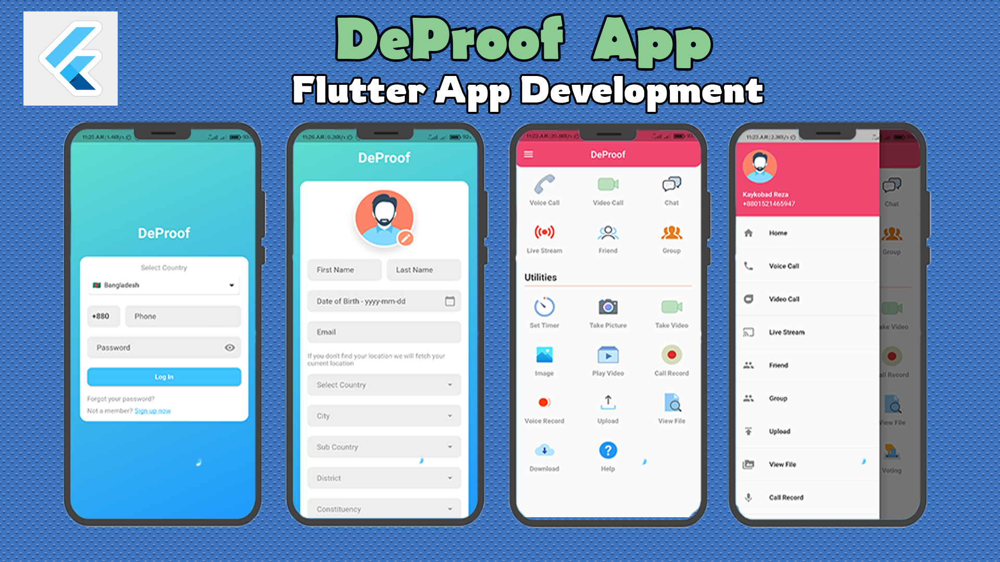

# DeProof - Uncover The Hidden Truth

## Overview
Elections must be transparent in order to be acceptable. DeProof app is built to ensure transparency in any election. With it's powerful feature like auto audio/video recording, file uploading, image capturing, timer based audio/video capturing and uploading, live streaming and other capabilities, agents can ensure a transparent and acceptable election.

## Features
- User Authentication with Emai-Password           
- User Profile Management         
- Auto Audio/Video Recording           
- Timer Based/Auto File Uploading           
- Timer Based/Auto Image Capture and Upload                  
- Live Streaming            
- Powerful Admin Panel                 
- Control Agent Phone(Camera, Mic ect.) via The Admin Panel         
- Auto Erase Data Upon Accident                 
- Much More...    

## Important Information About the App
- **Time Line:** 8th December, 2020 - 22nd February, 2021            
- **Framework:** [Flutter](https://flutter.dev/)  
- **Backend:** [Firebase](https://firebase.google.com/), [Laravel](https://laravel.com/)         

[Reach out to me](https://kaykobadreza.com/) for more information about the app or its development process. I'll be happy to bring your idea to reality.   
