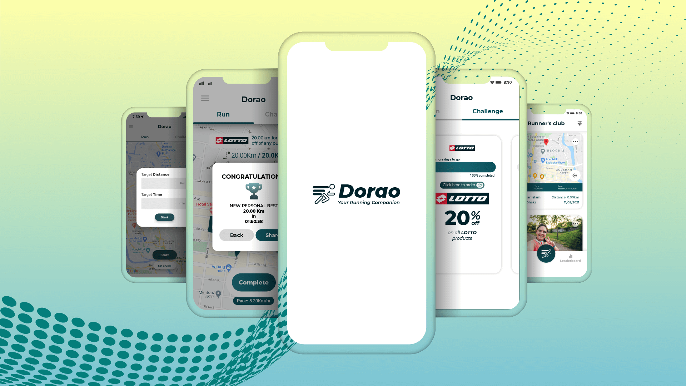

# [Dorao - Your Running Companion](https://kaykobadreza.com/blog/dorao-your-running-companion/)

## Overview
Concerned about your health yet lack the incentive to be physically active? Staying fit has now become more rewarding with Dorao. Track the distance you walk or run and complete challenges from your favorite stores or brands to get exciting offers in the form of discount codes with Dorao. With everyday challenges, you'll always be motivated. Keep a log of your time and distance covered, track your stats. Stay fit and save money.

Complete challenges with the Dorao app with only 3 Steps to claim your reward:    
- Choose your challenge: Pick challenges from your favorite brands    
- Track your run: Set your target and start your run; the app will keep track of your challenge     
- Claim your reward: Earn your reward by completing challenges & competing with others.

## Community:
- Record routes on your Dorao feed so friends & followers can comment & share their progress.     
- Your cycle route is the best? Share the route map & photos of your latest bike ride.      
- Join Clubs of brands, teams, and friends, or create your own group for activities.   
- See the leaderboard to find out who ran the most in the past day/week/month             

## Demo Video
     

## Features
- User Authentication with Email and Phone Verification            
- Social Login (Facebook, Google and Apple)        
- Location Tracking (Foreground & Background)       
- Activity Monitoring (Running, Walking, Riding etc.)       
- Route Tracking on Map During Each Run             
- Share Route Image or Run Statistics Card to Social Media          
- View Previous Run Histories         
- Push Notification         
- Inbox Notifications          
- Challenges with Rewards          
- Creating Group with Leaderboard and Social Platform        
- Post monitoring, reporting, kick user and much more group admins       
- User Profile Management         
- Admin Dashboard        
- Complete user analytics for admins          
- and much more!            

## Important Information About the App
- **Time Line:** 3rd July, 2021 - 4th August, 2022           
- **Framework:** [Flutter](https://flutter.dev/)
- **Backend:** [Firebase](https://firebase.google.com/)
- **Google Play:** [Dorao - Your Running Companion](https://play.google.com/store/apps/details?id=com.dorao.doraoApp)

[Reach out to me](https://kaykobadreza.com/) for more information about the app or its development process. I'll be happy to bring your idea to reality.