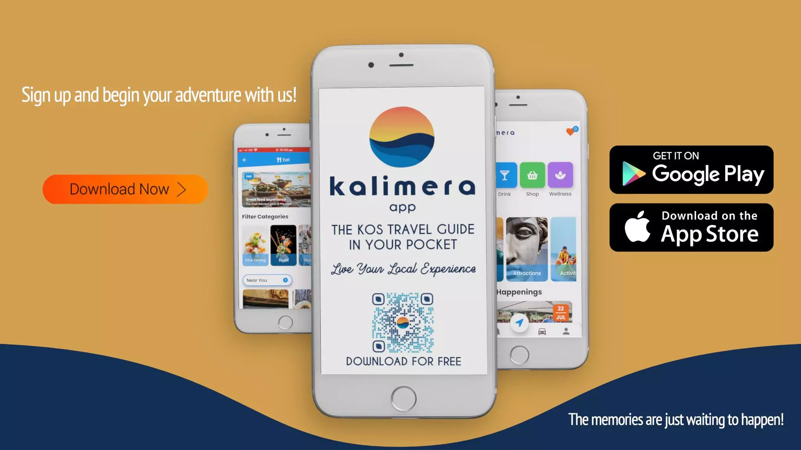

# [Kalimera - Tour Guide to Greece](https://portfolio.kaykobadreza.com/portfolio/kalimera/)

## Overview
One of my clients from Greece asked me if I could help him build an app that works as a tourist guide to the visitors of Kos in Greece. He said, "The app needs to be on both platforms(Android & iOS) and should deliver the best experience to the tourists."

The challenge was to build a tourist app on both Android and iOS to deliver the best experience to its users. The app should not only be fast and smooth, but it should also be loaded with lots of cool features along with real-time data reload, push notifications, events, user analytics, location tracking, and much more!

I took this awesome opportunity to build my very first international tourist guide app. After working for four months, finally, the app got published on both Play Store & App Store. I built Kalimera with Flutter as a cross-platform mobile framework and Firebase as the backend. Flutter gives the native performance and experience, while Firebase provides us with real-time database, user monitoring, push notification, analytics, and other services.

## Demo Video

## Features
- User Authentication with Email & Password
- Social Login (Facebook, Apple, and Google)
- User Profile Management
- Location Tracking
- Push Notification
- Event Creation, Management & Booking
- Eat/Drink/Shop/Personal Wellbeing Search and Booking
- Beach/Attractions/Local Experiences Search & Booking
- Transport (Bus & Taxi) Booking
- User Analytics
- and much more...

#### Look what the owner says about the app:
> Kalimera app connects Kos’ visitors with the local experience they deserve. We aim to offer you the best experience possible and the most beautiful memories to take back home from the most popular spots to the best-hidden gems.
> Kalimera is derived from the Greek words "καλή" and "ημέρα" which translates to Good Day, and that's what we at Kalimera app strive to achieve for our users, for them to have a good day.

## Important Information About the App
- **Framework:** [Flutter](https://flutter.dev/)
- **Backend:** [Firebase](https://firebase.google.com/)
- **Play Store:** [Kalimera - Android App](https://play.google.com/store/apps/details?id=com.outergaze.kosapp)
- **App Store:** [Kalimera - iOS App](https://apps.apple.com/gr/app/kalimera/id1572166542)
- **Website:** [Kalimera - Website](https://kalimerapp.eu/)
- **Facebook Page:** [Kalimera App Facebook Page](https://www.facebook.com/app.kalimera)    

[Reach out to me](https://kaykobadreza.com/) for more information about the app or its development process. I'll be happy to bring your idea to reality.