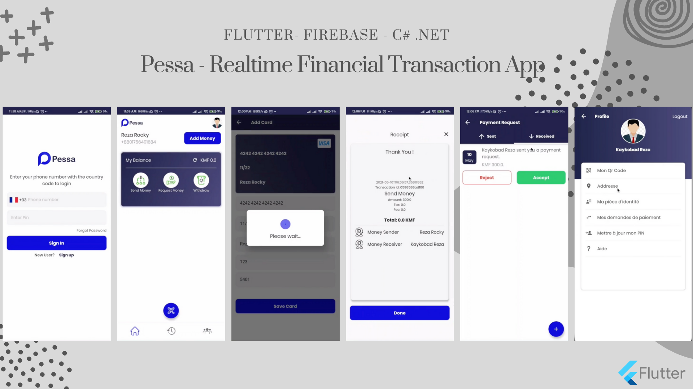

# Pessa - Real-Time Financial Transaction

## Overview
Pessa is a complete mobile wallet which lets you add money from any card, send money to your friends instantly, cashout from specific points, request payments and much more.     

You can register a new account in a few seconds right from Pessa App, using your Phone number and National Id. Now you have an account, but you need money in it, right? Transfer funds instantly from your card, to any Pessa account using the Add Money service. Use the Scan QR button in the home screen for Sending/Requesting money from anyone – faster and error-free. See the list of payment requests and transaction history in the history tab. Manage your profile from the profile menu.       

## Demo Video
       

####

In a word, Pessa app lets users Register with his mobile number and enables him to add money from any card, send money to his friends, cashout from anywhere, request payments, manage profile and much more without worring about security.

## Features
- User Authentication with Phone Number Verification     
- User Profile Management      
- Add Money from Any Card      
- Send Money to Anyone       
- Request Money from Anyone             
- Transaction History     
- Automatic Money Receipt          
- Scan QR to Send/Request Money     
- Notifications and Alerts             
- Much More...    

## Important Information About the App
- **Time Line:** 12th February, 2021 - 22nd April, 2021      
- **Framework:** [Flutter](https://flutter.dev/)  
- **Backend:** [Firebase](https://firebase.google.com/), [C# .NET](https://docs.microsoft.com/en-us/dotnet/csharp/)         

[Reach out to me](https://kaykobadreza.com/) for more information about the app or its development process. I'll be happy to bring your idea to reality.   

