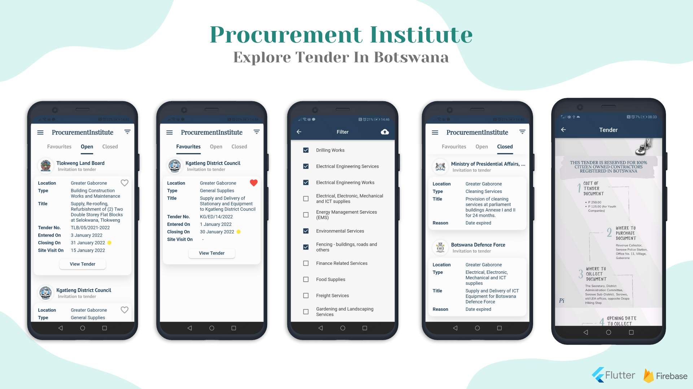

# [Procurement Institute - Explore Tenders in Botswana](https://portfolio.kaykobadreza.com/portfolio/procurement-institute/)

## Overview
Finding, searching, or submitting tenders are quite hectic as users need to search different corporate offices periodically which is both time-consuming and cumbersome. Procurement Institute collects all the gazetted tenders in one simple app so that users can find and learn about tenders of their choice easily and reliably. Procurement Institute app keeps users updated about different tenders, site visiting dates, or tender submitting dates along with user preferences and filtering.

## Why should I use Procurement Institute?

- Save time traveling & cut costs, eliminate the hassle of sourcing tender information.
    - Get instant access to a multitude of tenders on our platform.     

- Be efficient, shift from the traditional paper-based tender's that are clustered, difficult to navigate and read.
    - Tenders published through 'Pi' are modernized to enhance readability. Information is organized into coherent Sub-sections.     

- Get notified, avoid missing crucial information.
    - Receive notifications on every tender publication, amendment, or cancellation. Get reminders on scheduled Site-visits and be informed before a tender expires.     

- Filter information per your requirements.
    - Our search function allows you to filter out information deemed unrequired as per each user's requirements. Get information that is only relevant to you.     

- Weekly summary reports; Outlines tender's released and closed that week for each Sub-District and Industry.
    - Get free weekly summary reports indicating the main points and key details on all tenders published every week.      
    
## Features
- User Authentication with Email & Password
- Social Login (Facebook, Apple, and Google)
- User Profile Management
- Ability to Set User Preference
- Tender Filtering and Searching
- Reminder About Site Visiting and Tender Closing Dates
- Push Notification
- In-App purchase
- Real-Time Database Update Reflection
- Different settings, configurations, and much more...

## Important Information About the App
- **Framework:** [Flutter](https://flutter.dev/)
- **Backend:** [Firebase](https://firebase.google.com/)
- **Google Play:** [Procurement Institure](https://play.google.com/store/apps/details?id=com.procurementinstitute.procurement_institute/)       

[Reach out to me](https://kaykobadreza.com/) for more information about the app or its development process. I'll be happy to bring your idea to reality.